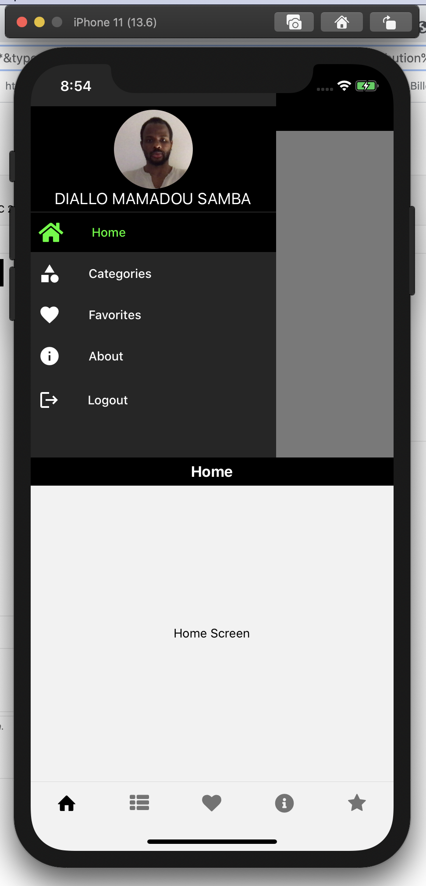
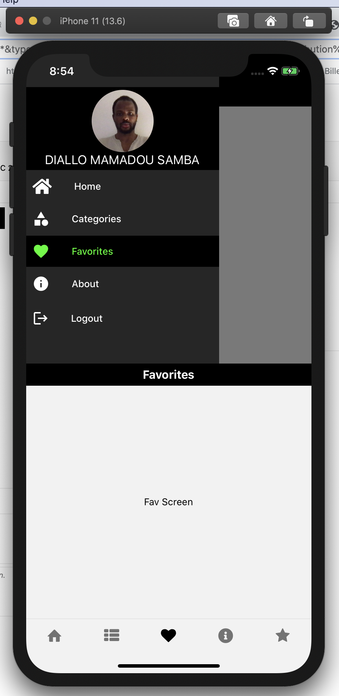
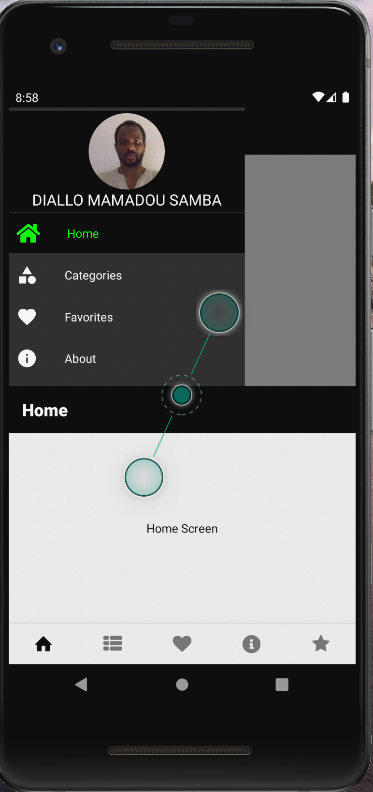
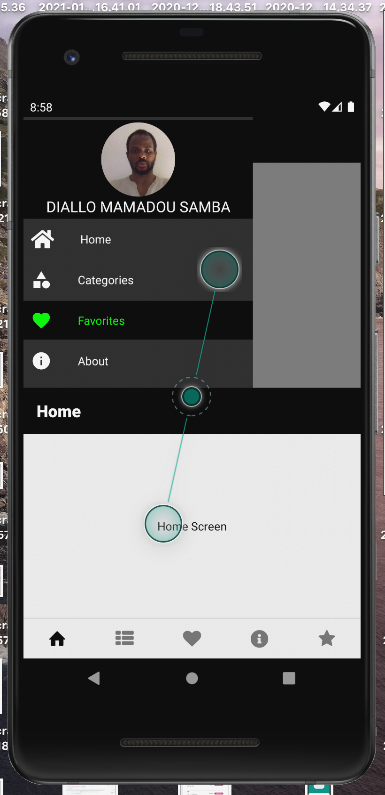

React-Native-Templates-New
Templates for react native using react native v5 and vector icons. This has 3 templates that includes DrawerNavigator, TabBarNavigator and TopNavigator. It also includes vector icons as well as some custom fonts. If you are wishing to use only one navigator then remove all other dependencies by running following commands

Clone the repo and run npm install
This will install all the required dependencies.

For Navigation Drawer Only
run "npm uninstall @react-navigation/material-top-tabs @react-navigation/bottom-tabs"

For Bottom Tabs Only
run " npm uninstall @react-navigation/material-top-tabs @react-navigation/drawer"

For Top Tabs Only
run "npm uninstall @react-navigation/bottom-tabs @react-navigation/drawer"
Don't forget to delete the files that you don't need.

# Screen Shots

